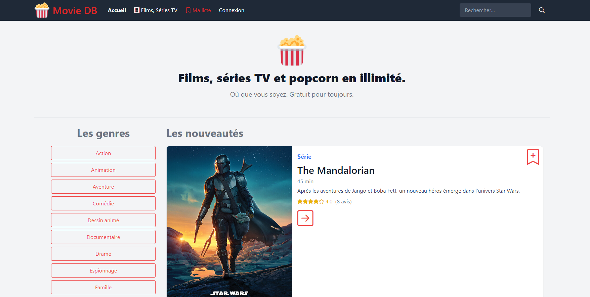
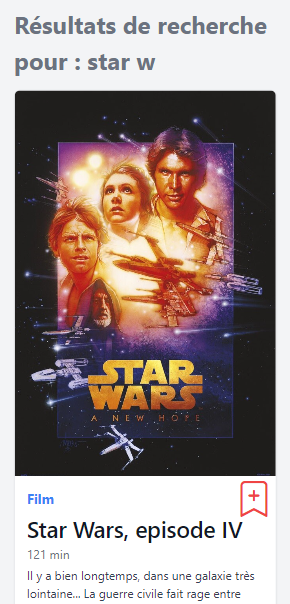
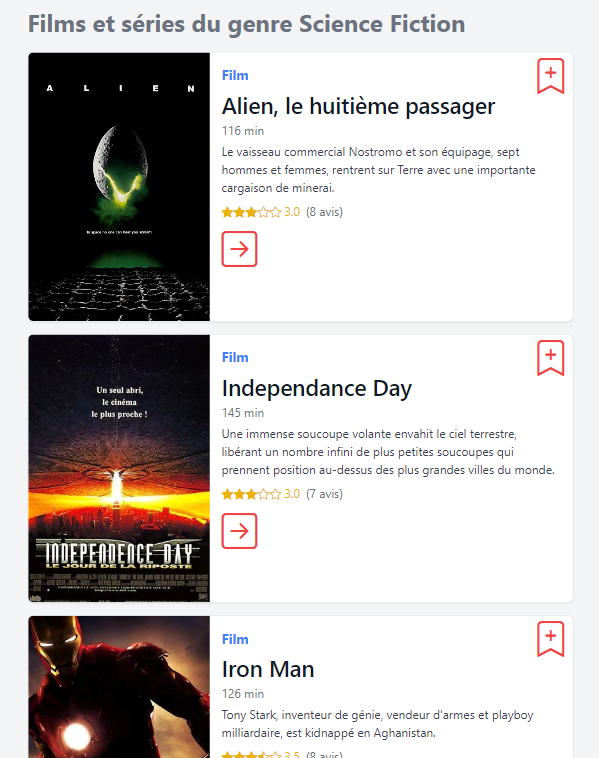
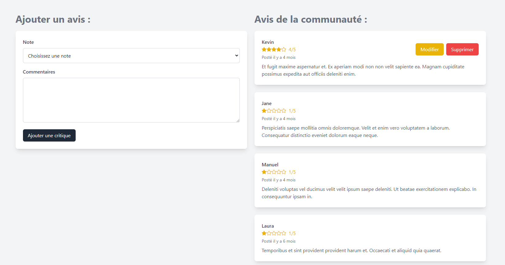
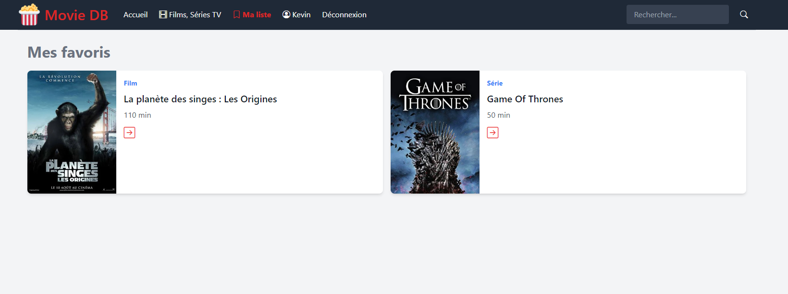

# Movie DB

## Présentation

Bienvenue dans l'application Movie DB. Ce projet est une application permettant d'afficher une liste de films et séries et de pouvoir accéder aux détails : Durée, Castings, Genre, Avis. Un utilisateur une fois inscrit et connecté peut ajouter un film ou une série à ses favoris. Il peut également laisser des avis et noter un film ou une série.
Ce projet a été développé en PHP avec le framework Laravel (version 11), le moteur de template Blade, Tailwind pour générer la quasi totalité du CSS, et MySQL (via l'ORM Eloquent) pour la gestion de la base de données.

## Résultat

Quelques aperçus de l'application :












## Fonctionnalités

- Affichage d'une liste de films/séries paginer (10 par page)
- Filter les films/séries par genre en cliquant sur le bouton correspondant ou via une barre de recherche
- Application responsive
- Système d'authentification complet et sécurisé : Inscription, connexion, déconnexion, modification des informations personnelles (réalisé sans outils)
- Ajout d'avis sur un film ou une série et possibilité de le modifier ou de le supprimé (Cette fonctionnalité réservée aux utilisateurs authentifiés)
- Enregistrer des films ou séries en favoris et pouvoir les consultés sur une page spécifique (Cette fonctionnalité réservée aux utilisateurs authentifiés)

## Installation

NB: dans le dossier `public/data` se trouve un fichier SQL contenant une trentaine de films/séries qui peuvent être ajouté une fois le projet installé.

### Prérequis

- PHP 8.x
- Composer
- Node.js avec npm
- MySQL

### Etapes d'installation

1. **Cloner le dépôt**

```bash
   git clone https://github.com/votre-nom-utilisateur/movie-db.git
```

2. **Installer les dépendances**

```bash
    composer install
```

3. **Configurer l'environnement**

Copier le fichier ".env.example" pour créer votre propre fichier de configuration ".env"

4. **Paramétrer la connexion à votre base de données**

Mise à jour des lignes suivantes en fonction de l'environment choisi :

```bash
DB_CONNECTION=mysql
DB_HOST=127.0.0.1
DB_PORT=3306
DB_DATABASE=movie_db
DB_USERNAME=root
DB_PASSWORD=
```

5. **Paramétrer le service de mail pour activer la fonctionnalité "Mot de passe oublié"**

Configurez votre service de mail dans le fichier ".env" : 

```bash
MAIL_MAILER=smtp
MAIL_HOST=smtp.mailtrap.io
MAIL_PORT=2525
MAIL_USERNAME=null
MAIL_PASSWORD=null
MAIL_ENCRYPTION=null
MAIL_FROM_ADDRESS="noreply@moviedb.com"
MAIL_FROM_NAME="${APP_NAME}"
```

6. **Créer la base de données et exécuter les migrations**

```bash
    php artisan migrate --seed
```

7. **Démarrer le serveur de développement**

```bash
    php artisan serve
```
L'application sera accessible à l'adresse `http://localhost:8000`.

## Contribution

Les contributions sont les bienvenus ! Si vous avez des idées d'améliorations ou des bugs à signaler, n'hésitez pas à ouvrir une issue ou un pull request.
